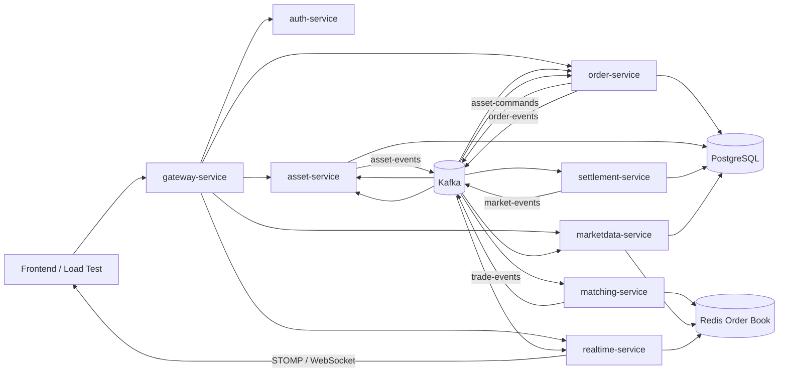
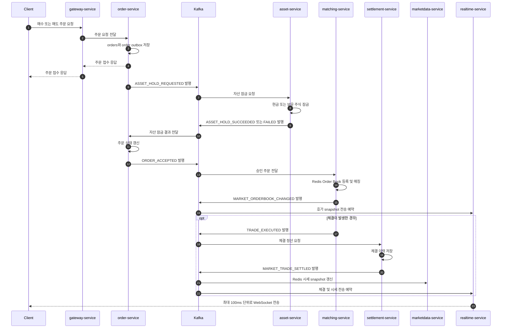

# Stock Market

Kafka, Redis, PostgreSQL 기반의 실시간 모의 주식 거래 플랫폼입니다. 주문 접수부터 자산 잠금, Redis Order Book 매칭, 체결 정산, 시세 캐시 갱신, WebSocket 전송까지의 흐름을 서비스 역할별로 분리했습니다.

## Features

- JWT Access Token과 HttpOnly Refresh Token Cookie 기반 인증
- 매수/매도 주문, 주문 취소, 미체결/체결 내역 및 포트폴리오 조회
- Redis ZSET, HASH, LIST 기반 가격 우선/시간 우선 Order Book
- Redis Lua Script 기반 주문 등록, 매칭, 잔량 갱신의 원자적 처리
- Transactional Outbox를 통한 PostgreSQL 저장과 Kafka 발행 간 불일치 완화
- Kafka 이벤트 기반 자산 잠금, 주문 승인, 매칭, 정산 처리
- Redis 시세 snapshot 기반 종목 리스트, 호가창, 차트 조회
- STOMP WebSocket 기반 종목 리스트, 호가창, 체결 내역 실시간 전송
- Prometheus, Grafana, Locust 기반 관측 및 부하 테스트

## Architecture



## Services

| Service | Port | Responsibility |
| --- | ---: | --- |
| `gateway-service` | `8080` | 외부 HTTP/WebSocket 단일 진입점 및 라우팅 |
| `auth-service` | `8087` | 회원가입, 로그인, 토큰 재발급, 로그아웃 |
| `asset-service` | `8088` | 예수금/보유 주식 잠금, 해제, 체결 자산 반영, 포트폴리오 조회 |
| `order-service` | `8082` | 주문 접수/취소, 주문 상태 및 주문 이력 관리 |
| `matching-service` | `8083` | Kafka 주문 이벤트 소비, Redis Order Book 매칭 |
| `settlement-service` | `8084` | 체결 이력 저장 및 시장 정산 완료 이벤트 발행 |
| `marketdata-service` | `8085` | 종목 리스트, 호가창, 차트 조회 및 Redis 시세 snapshot 갱신 |
| `realtime-service` | `8086` | STOMP WebSocket, 실시간 체결/호가/종목 리스트 전송 |

외부 클라이언트는 원칙적으로 `gateway-service:8080`만 사용합니다. 개별 서비스 포트는 로컬 디버깅과 관측을 위해 열려 있습니다.

## Request Routing

| Path | Target service |
| --- | --- |
| `/api/v1/auth/**` | `auth-service` |
| `/api/v1/users/**` | `asset-service` |
| `/api/v1/orders/**` | `order-service` |
| `/api/v1/stocks/**` | `marketdata-service` |
| `/ws`, `/ws/**` | `realtime-service` |

## Event Flow

### 매수/매도 주문 흐름



### Event topics

| Topic | 주요 이벤트 | Producer | Consumer |
| --- | --- | --- | --- |
| `asset-commands` | `ASSET_HOLD_REQUESTED` | order-service | asset-service |
| `asset-events` | `ASSET_HOLD_SUCCEEDED`, `ASSET_HOLD_FAILED` | asset-service | order-service |
| `order-events` | `ORDER_ACCEPTED`, `ORDER_CANCEL_REQUESTED` | order-service | matching-service |
| `trade-events` | `TRADE_EXECUTED`, `ORDER_CANCELED`, `ORDER_REJECTED` | matching-service | order-service, asset-service, settlement-service |
| `market-events` | `MARKET_TRADE_SETTLED`, `MARKET_ORDERBOOK_CHANGED` | settlement-service, matching-service | marketdata-service, realtime-service |

## Consistency and Idempotency

- 주문과 발행할 이벤트를 같은 DB 트랜잭션에 Outbox 행으로 저장합니다.
- 각 서비스의 Outbox Publisher가 `PENDING` 행을 폴링하여 Kafka에 발행하고, 성공 시 `SENT`로 변경합니다.
- `clientOrderId`로 동일 사용자의 중복 주문 요청을 방지합니다.
- Redis의 주문 키 존재 여부와 Lua Script를 사용해 중복 호가 등록과 경합을 방지합니다.
- 체결 이벤트 ID와 주문별 체결 이력의 고유 제약을 사용해 중복 정산을 방지합니다.

## Redis Order Book

종목별 호가창은 Redis에 유지합니다.

- `ZSET`: 가격 우선순위. 매수는 높은 가격, 매도는 낮은 가격을 우선합니다.
- `LIST`: 동일 가격 안에서 먼저 들어온 주문을 먼저 처리합니다.
- `HASH`: 가격별 잔량과 주문 상세를 저장합니다.
- Lua Script: 주문 등록, 반대 호가 탐색, 체결, 잔량 갱신, 취소를 Redis 내부에서 원자적으로 수행합니다.

## Realtime Delivery

| STOMP topic | Payload | Delivery policy |
| --- | --- | --- |
| `/topic/stocks` | 전체 종목 시세 snapshot | 변경 요청을 모아 최대 100ms마다 발행 |
| `/topic/stocks/{stockCode}/orderbook` | 특정 종목 호가창 snapshot | 변경 요청을 모아 최대 100ms마다 발행 |
| `/topic/stocks/{stockCode}/trades` | 개별 체결 내역 | 체결 이벤트 수신 시 발행 |

`realtime-service`는 시장 이벤트를 받은 뒤 변경된 종목 코드를 메모리에 표시합니다. 내부 스케줄러가 최대 100ms 간격으로 Redis에서 최신 호가/시세 snapshot을 조회해 WebSocket 구독자에게 전송합니다.

## Tech Stack

- Java 17, Spring Boot 3, Spring Data JPA, Spring Cloud Gateway
- PostgreSQL 15, Redis 7, Apache Kafka
- Spring WebSocket, STOMP
- Docker Compose
- Prometheus, Grafana
- Locust

## Project Structure

```text
.
├── common/
│   ├── event-contracts/       # Kafka topic, event type, shared event contract
│   └── security-common/       # JWT verification and shared security components
├── services/
│   ├── auth-service/
│   ├── asset-service/
│   ├── order-service/
│   ├── matching-service/
│   ├── settlement-service/
│   ├── marketdata-service/
│   ├── realtime-service/
│   └── gateway-service/
├── db/
│   ├── init/                 # Fresh PostgreSQL initialization schema
│   └── migrations/           # Existing database migration scripts
├── loadtest/                 # Locust scenario and test-user scripts
├── monitoring/               # Prometheus and Grafana provisioning
├── Dockerfile.service
└── docker-compose.yml
```

## Prerequisites

- JDK 17
- Docker Desktop and Docker Compose
- Python 3.10+ for Locust load tests

## Docker Compose 실행

Dockerfile은 미리 빌드된 서비스 JAR를 복사해 이미지를 생성합니다. Compose 실행 전에 모든 서비스 JAR를 빌드합니다.

```bash
./gradlew bootJar
docker compose up -d --build
```

서비스 상태는 다음 명령으로 확인합니다.

```bash
docker compose ps
curl http://localhost:8080/actuator/health
```

주요 로컬 주소는 다음과 같습니다.

| 구성 요소 | URL |
| --- | --- |
| Gateway API | `http://localhost:8080` |
| Kafka UI | `http://localhost:8081` |
| Prometheus | `http://localhost:9090` |
| Grafana | `http://localhost:3000` |

환경을 종료하려면 다음 명령을 실행합니다.

```bash
docker compose down
```

PostgreSQL, Redis, Kafka 등의 볼륨까지 삭제해 전체 데이터를 초기화하려면 다음 명령을 사용합니다.

```bash
docker compose down -v
```

`db/init/001-schema.sql`은 PostgreSQL 데이터 볼륨이 새로 생성될 때만 실행됩니다. 기존 볼륨을 사용하는 경우에는 필요한 SQL을 `db/migrations/`에서 직접 적용해야 합니다.

## 서비스별 로컬 실행

PostgreSQL, Redis, Kafka를 먼저 실행한 뒤 필요한 서비스만 로컬에서 실행할 수 있습니다.

```bash
./gradlew :services:marketdata-service:bootRun
```

다른 서비스 실행 예시입니다.

```bash
./gradlew :services:auth-service:bootRun
./gradlew :services:order-service:bootRun
./gradlew :services:matching-service:bootRun
./gradlew :services:settlement-service:bootRun
./gradlew :services:realtime-service:bootRun
./gradlew :services:gateway-service:bootRun
```

## API Summary

| Method | Path | Description |
| --- | --- | --- |
| `POST` | `/api/v1/auth/signup` | 회원가입 |
| `POST` | `/api/v1/auth/login` | 로그인 및 Access Token 발급 |
| `POST` | `/api/v1/auth/refresh` | Refresh Cookie 기반 Access Token 재발급 |
| `POST` | `/api/v1/auth/logout` | 로그아웃 |
| `GET` | `/api/v1/users/me/assets` | 내 자산/보유 종목 조회 |
| `POST` | `/api/v1/orders` | 매수/매도 주문 접수 |
| `POST` | `/api/v1/orders/{orderId}/cancel` | 주문 취소 요청 |
| `GET` | `/api/v1/orders/me` | 미체결/체결 주문 이력 조회 |
| `GET` | `/api/v1/stocks` | 종목 리스트/시세 조회 |
| `GET` | `/api/v1/stocks/{stockCode}/orderbook` | 호가창 조회 |
| `GET` | `/api/v1/stocks/{stockCode}/chart` | 체결가 차트 조회 |

## Notes

- Kafka의 at-least-once 전달 환경에서 중복 메시지가 발생할 수 있으므로, 주문·자산·체결 처리에 고유 제약과 처리 이력 기반의 멱등성 검증을 적용했습니다.
- Redis는 빠른 매칭과 시세 조회를 위한 운영 상태 저장소이며, PostgreSQL의 주문/계좌/체결 데이터가 최종 기록입니다.
